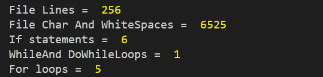
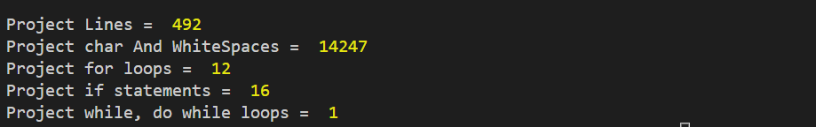

# code-statistics

Node.js code-statistics library  
Release 1.0.1

## Features

+ Reports line counts for one file or a project.
+ Reports characters and whitespace counts for one file or a project.
+ Reports total uses;
  + If statement.
  + For, while, do while loops.

+ Pure JavaScript
+ Show code statistics for your project files written in javascript, java.

## Example

+ Use it to check a file code

```javascript
import { ProjectFilesReader } from 'Code-statistics/ProjectFilesReader.js'
import { CheckFileCode } from 'Code-statistics/CheckFileCode.js'

const reader = new ProjectFilesReader()
const myFile = new CheckFileCode()

const fileAsText = await reader.convertFileIntoString('test/test-file.js')

console.log('File Lines = ', myFile.countFileLines(fileAsText))

console.log('File Char And WhiteSpaces = ', await myFile.countFileCodeCharAndWhiteSpaces(fileAsText))

console.log('If statements = ', await myFile.countFileIfStatements(fileAsText))

console.log('WhileAnd DoWhileLoops = ', await myFile.countFileWhileAndDoWhileLoops(fileAsText))

console.log('For loops = ', await myFile.countFileForLoops(fileAsText))
```

The output :

  

+ Use it to check a project

```javascript
import { ProjectCodeChecker } from './ProjectCodeChecker.js'
import { ProjectFilesReader } from './ProjectFilesReader.js'

const reader = new ProjectFilesReader()
const myProject = new ProjectCodeChecker()


const projectFilesPathsArray = await MyProjectFiles.getDirectoryFilesPaths('tets/test-project/src')
console.log('Project Lines = ', await myProject.countProjectLines(projectFilesPathsArray))

console.log('Project char And WhiteSpaces = ', await myProject.countProjectCharacters(projectFilesPathsArray))

console.log('Project for loops = ', await myProject.countProjectForLoops(projectFilesPathsArray))

console.log('Project If statements = ', await myProject.countProjectIfStatements(projectFilesPathsArray))

console.log('Project While, do while loops = ', await myProject.countProjectWhileAndDoWhileLoops(projectFilesPathsArray))
```

The output :



## installing

```shell
npm i code-statistics
```
To learn how to download npm packages  
https://www.youtube.com/watch?v=5FIyNwBMADo
### License  

[MIT](https://libraries.io/licenses/MIT)

### Release  

1.1.1
