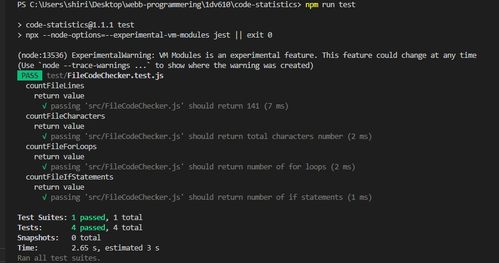

# Mall för inlämning laboration 1, 1dv610
​
## Checklista
  - [x] Jag har skrivit all kod och reflektioner själv. Jag har inte använt mig av andras kod för att lösa uppgiften.
  - [x] Mina testresultat är skrivna utifrån utförd testning ( och inte teoretiskt: "det bör fungera" :) )
  - [x] Koden är objektorienterad
  - [x] Jag har skrivit en modul som riktar sig till programmerare
​
## Egenskattning och mål
  - [ ] Jag är inte klar eftersom jag vet att jag saknar något. (Då skall du inte lämna in! Lämna då istället in på restlaboration.)
  - [x] Jag eftersträvar med denna inlämning godkänt betyg (E-D)
    - [x] De flesta testfall fungerar
    - [x] Koden är förberedd på Återanvändning
    - [ ] All kod samt historik finns i git 
    - [x] Kodkvaliterskraven är ifyllda
    - [x] Reflektion är skriven utifrån bokens kapitel 
  - [ ] Jag eftersträvar med denna inlämning högre betyg (C-B) och anser mig uppfylla alla extra krav för detta. 
    - [ ] Samtliga testfall är skrivna    
    - [x] Testfall är automatiserade
    - [x] Det finns en tydlig beskrivning i hur modulen skall användas (i git)
    - [x] Kodkvalitetskraven är varierade 
  - [ ] Jag eftersträvar med denna inlämning högsta betyg (A) 
​
Förtydligande: Examinator kommer sätta betyg oberoende på vad ni anser. 
​
## Återanvändning
(redme.md)[https://github.com/Shirin20/code-statistics]
​
## Beskrivning av min kod
Beskriv din kod på en hög abstraktionsnivå. En kort beskrivning av dina viktigaste klasser och metoder. Skapa gärna ett klassdiagram som bild. Använd det ni lärt er så här långt i 1dv607. Kommunicera så att jag kan förstå.
Jag har 4 moduler 
* ProjectFilesReader.js 
Den läser in filer och exkrterar Kataloger till filler  och sen konverterar innehållen på filerna till texter(string)  
* FileCodeChecker.js  
Den tar file text innehåll och räknar rader , charecters hur många looper och satser
* ProjectCodeChecker.js  
Den tar an array of file pathes och sen räknar rader , charecters hur många looper och satser
*ErrorHandlar.js  
Den kastar lämplig fel meddelande när man matar in fel data 
[Diagram](test/img/diagram.png)
​
## Hur jag testat
programmet var testat genom hela utvecklings tiden med automatiska tester for två klasses (ProjectCodeChecker.js och FileCodeChecker.js som använder andra klassers metoder (ErrorHandlar.js , ProjectFilesReader.js) genom att använda jest ramverk.)
​
### Testfall

​

​
## Kodkvalitetskrav
​
**Fetmarkera** de "regler" som används ur CC. Ni kan frångå tabellformat om ni vill. Skapa direktlänkar till er kod där det är lämpligt. Skriv så att jag kan förstå.
​
### Namngivning
| Namn och förklaring  | Reflektion                                   |
| -------------------  | ---------------------------------------------|
|**ProjektFilesReader** Klassnamn i modulen|  **Class names** ‘Classes and objects should have noun or noun phrase names like Customer, WikiPage, Account, and AddressParser’ Jag hade fel namn på mina klasser till example jag hade checkFileCode.js Som lätt som en metod när jag läste namnet efter en dag. Så jag ändrade namnet till FileCodeChecker.js|
| **countProjectLines(dirFilesPaths)** Metodnamn på metod som räknar hur många rader finns i en hel project |**Method Names** Jag använde mig av en verbfras som förklarar tydligt vad metoden gör och returnerar Add meaningful context Metodens namn är klar att den kommer att räkna antal rader på ett project.|
| **countProjectOperations (dirFilesPaths, operation)**   | **Add meaningful context** Metoden har en oklar namn, vilka operations  **Use Solution Domain names** CountProjectStatmentsAndLoops kan var bättre namn som kan tala om till oss att den kommer att räkna antal if satser och looper|
|**projectLines** är en variable i **countProjectLines(dirFilesPaths)** det är den value so ska returners | **Use Intention-Revealing Names** 'should answer all the big questions. It should tell you why it exists, what it does, and how it is used'. projectLines den säger att den innehåller ett värde som har att göra med lines men är dem raderna eller antal rader . Jag valde att byta den mot **projectLinesNumber**|
|**fileTextContent and fileAs text** | 'Pick One Word per Concept A consistent lexicon is a great boon to the programmers who must use your code'. Jag var inte konsistent när jag använde mig av två olika namner till samma koncept | 

### Funktioner
| Namn och förklaring  |antal rader ( ej ws )|  Reflektion                                   |
| -------------------  |-------------------- |---------------------------------------------|
|**#countFileOperations (fileAsText, operation)** | 12| **Blocks and Indentning**  metoden har bra indentering som gör att det är tydlig att det finns en for loop och att if satsen finns inuti den |
| **deleteCodeComments** |13 |**Do one thing** jag har kodat en metod som gör många saker , som gör det båda svårt och tid krävande att förstå koden den måste brytas ner till flera metoder med bätre variables namn |
| **countProjectOperations (dirFilesPaths, operation)**|12| **one level of abstraction** Metoden har två olika abstraktions nivå en med hög nivå när jag anroper andra metoder och en på låg nivå när jag använde mig, i sista delen av metoden, en for loop med Array.include **Function Arguments** denna metoden har två parametrar, och jag valde att behålla den andra prametren för att den gör det lättare och använde den för att räkna olika operationer|
|**deleteCodBlockComments(fileAsText)** |9| **monadic** den tat emot bara en agument och metoden
arbetar på det argumentet, förvandlar det till något annat och återlämnar det. den även använder två olika namn in och ut data |
|**countProjectCharacters (dirFilesPaths)**|10 | **Verbs and KeyWords** Parameter namn kan bytas mot projectFiles så det blir tydligare | 

​
## Laborationsreflektion
Jag läste delar av kapitel två innan jag började utveckla mitt bibliotek , så jag försökte från början ge mina variabler namn som kan ge alla svar som inte presenteras i koden vad som kallas Inention-avslöjande namn i boken , som gör det lätt att läsa och förstå min kod.
Efter att ha läst klart kapitel två insåg jag att jag hade fel namn på mina klasser , man ska använda substantiv eller substantivfraser som det nämns i boken, till exempel jag ändrade ett klassnamn från "checkFileCode" till "fileCodeChecker"
Jag var till och med tvungen att byta namn på variabler i en metod ‘deleteCodeComments(fileAsText)’ flera gånger bara så att jag lätt kan förstå vad den här metoden gör som en reader, men sedan insåg jag att det är ännu bättre att bryta ner funktionen till små funktioner så att varje funktion gör en sak vilken till och med gör det lättare att förstå nästlade looper. Och jag tyckte även att när det finns hög obstractions nivå i kods metoder desto lättare blir det att förstå koden som läsare.
